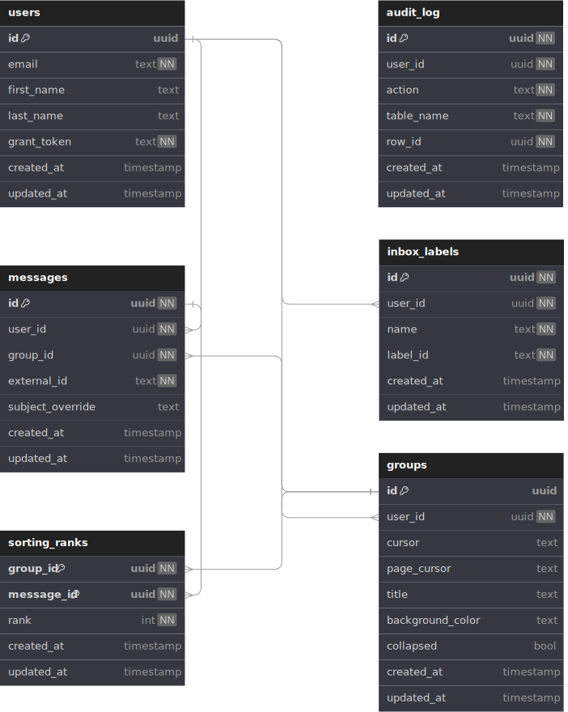

_This service provides a wrapper ontop of Nylas' API to support customized and extended email functionality within the Toodle application. Below is an embedded view of the database as presneted through DB diagram._

### Database Diagram

### Steps to run the service
* Ensure that Rust is [installed](https://www.rust-lang.org/tools/install) at the (minimum version: **1.78.x**)
* Having a running version of Postgres (minimum version: **16.2.x**)
  * A docker-compose file is included to quickly spin up a postgres 16.2.x instance
* Diesel CLI is leveraged to manage/maintain migrations for this project. Ensure that this is [installed](https://diesel.rs/guides/getting-started) and available within the shells path: minimum version: **2.1.x**
* This service maintains authentication through Auth0 please ensure that you have a sandbox auth0 instance and the appropriate credentials within the .env file
* Stack Exchange's blackbox is leveraged to securely encrypt developer files for use in local development. Ensure that you have blackbox installed and within your path. `brew install blackbox`

### ToDo List
[Please view the trello board](https://trello.com/b/VkKugqWk/toodle)